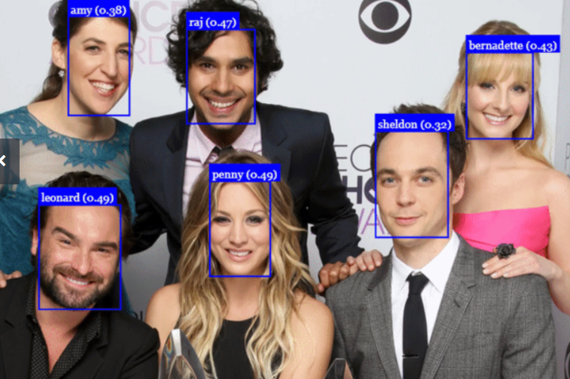

# Projeto de Reconhecimento Facial

Este projeto tem como objetivo desenvolver um sistema de reconhecimento facial utilizando modelos pré-treinados. O foco é aplicar modelos de detecção e classificação de faces para identificar e classificar rostos em imagens. Não há a necessidade de treinar modelos do zero, pois o projeto utiliza redes neurais previamente treinadas e adaptadas para o reconhecimento de faces.

## Funcionalidades

- **Detecção de Faces**: Utiliza modelos pré-treinados para detectar faces em imagens e vídeos.
- **Reconhecimento Facial**: Classifica as faces detectadas a partir de um banco de dados de rostos.

## Tecnologias Utilizadas

- **YOLOv11**: Para detecção de faces em tempo real.
- **DeepFace**: Biblioteca para integração de diferentes modelos de reconhecimento facial.
- **OpenCV**: Para manipulação de imagens e vídeos.

## Objetivo do Projeto

Este repositório tem como objetivo demonstrar o uso de modelos de reconhecimento facial, facilitando a integração de diversas redes neurais pré-treinadas para a detecção e identificação de rostos.

---

# Materiais de Apoio

### Criando um Sistema de Reconhecimento Facial do Zero

O objetivo principal desta atividade é trabalhar com as bibliotecas e frameworks estudados e analisados nas aulas. A proposta envolve um sistema de detecção e reconhecimento de faces, utilizando o framework **TensorFlow** em conjunto com outras bibliotecas que o projetista julgue necessárias.

### Etapas do Projeto

1. **Detecção de Faces**: Utilizar uma rede de detecção treinada para detectar faces em imagens.
2. **Reconhecimento de Faces**: Utilizar uma rede de classificação para identificar e classificar as faces detectadas.

O sistema deve ser capaz de detectar e reconhecer mais de uma face ao mesmo tempo, conforme ilustrado na Figura 1 abaixo.

#### Figura 1: Detecção e Reconhecimento Facial

  

### Trabalhos de Referência

Para realizar esta atividade, você pode se basear nos seguintes materiais:

- **Detecção Facial**: [Detecção Facial com TensorFlow](https://colab.research.google.com/drive/1QnC7lV7oVFk5OZCm75fqbLAfD9qBy9bw?usp=sharing)
  
- **Detecção e Classificação de Objetos**: [Detecção e Classificação de Objetos](https://colab.research.google.com/drive/1xdjyBiY75MAVRSjgmiqI7pbRLn58VrbE?usp=sharing)

### Slides

A apresentação completa utilizada neste módulo está disponível [AQUI](link-para-os-slides).  
Com isso, você terá acesso a todos os slides e links explorados durante as aulas.

---

**Bons estudos!** 👨‍💻
